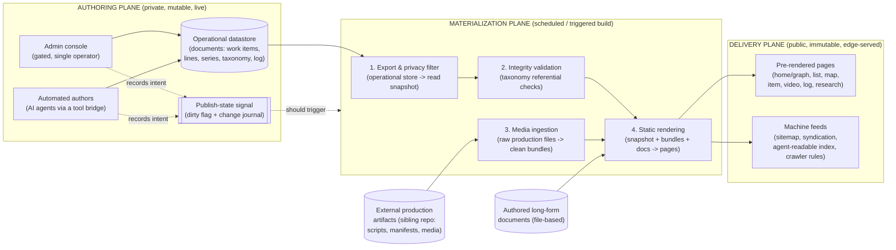
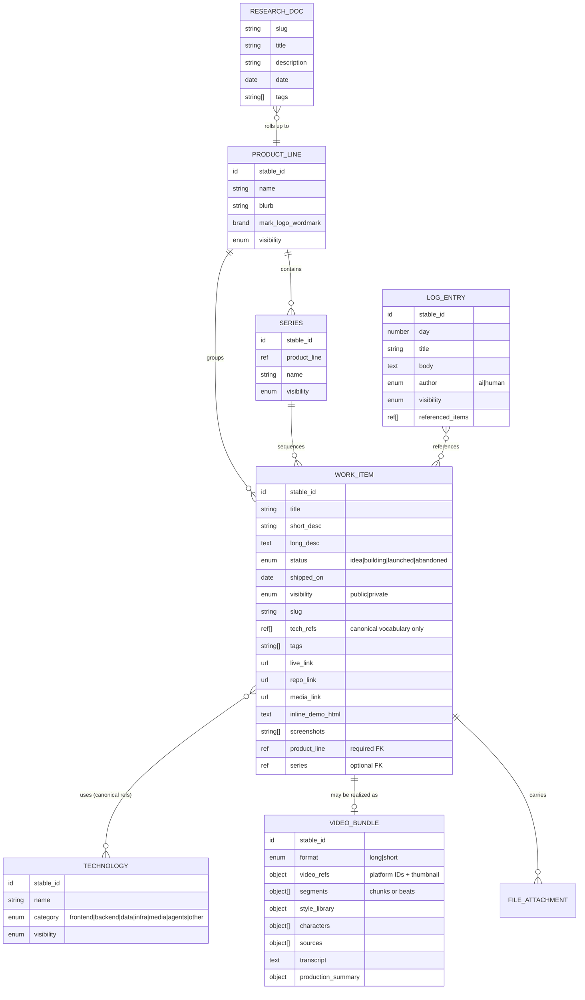
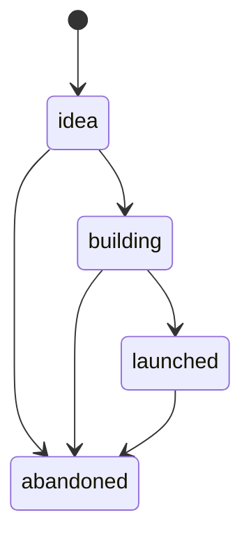
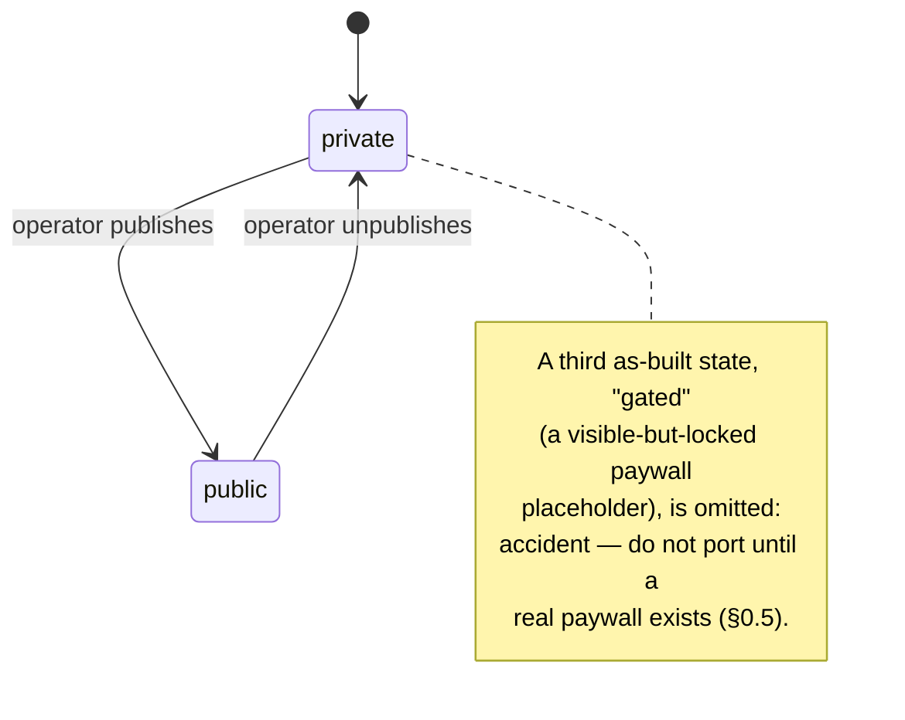
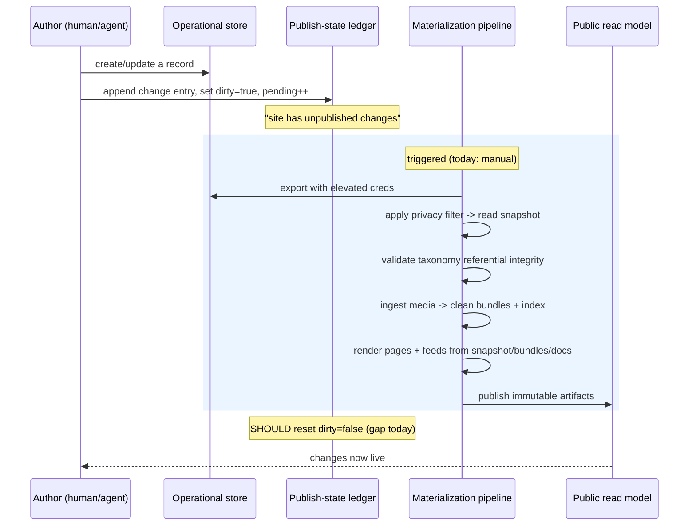
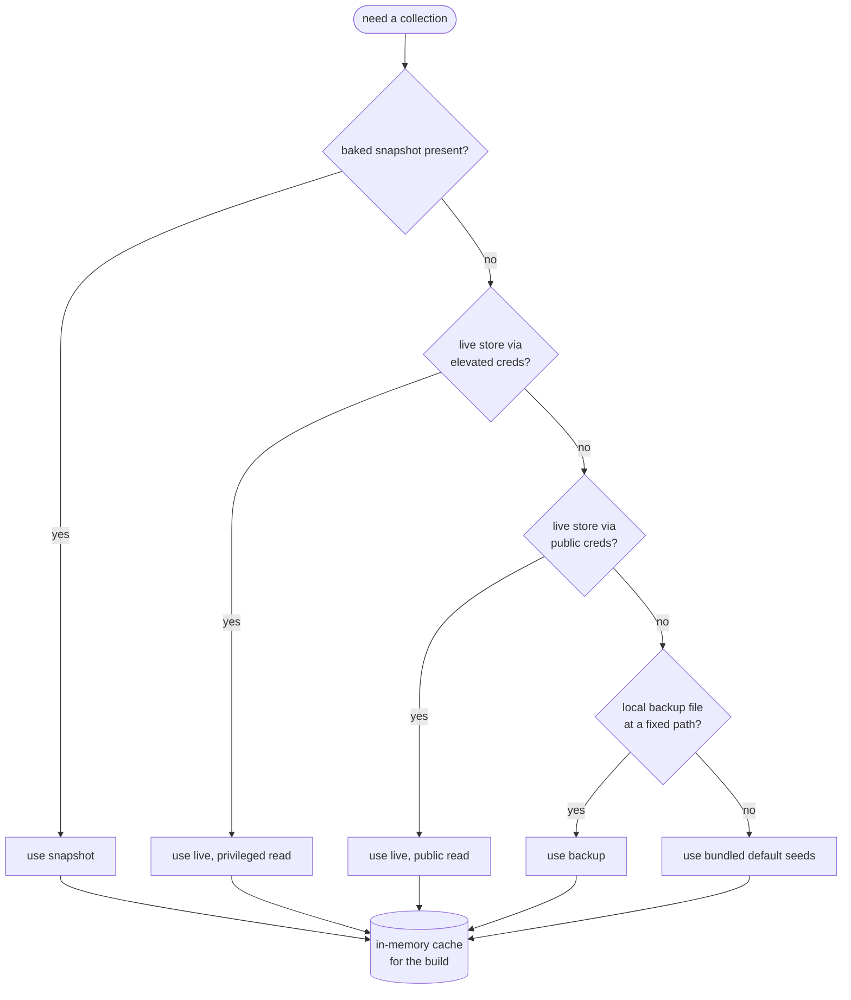
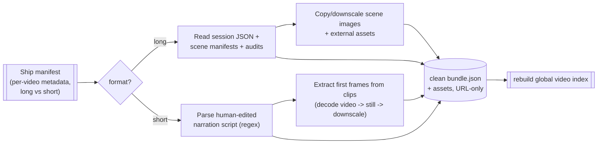
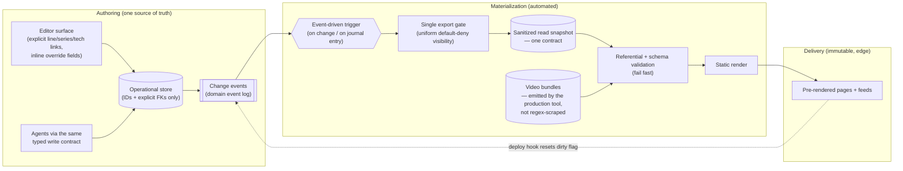

# CLEANROOM_SPEC.md

A technology-agnostic, conceptual blueprint of this application, written for a clean-room rebuild. It describes **what the system does and why**, not how the current code does it. No framework names, no database flavors, no library calls, no source excerpts — only the logical architecture, the domain model, the data contracts, the rules, and the patterns worth keeping or replacing.

> **How to read this**
> - **Part 1 — The Conceptual Map** gives you the mental model: the planes the system is split into, the components inside them, and the domain entities that flow through them.
> - **Part 2 — Core Logic & Data Flows** is the reference: the agnostic business rules, the data contracts, and the state machines.
> - **Part 3 — The Better Way** is the rebuild guidance: where the current design fights itself, and the patterns that dissolve those problems.

---

## Part 0 — The system in one breath

This is a **personal build-archive and showcase**. One author ships a stream of *work items* — software projects, narrated videos, research writeups, and dated log entries — over a fixed 100-day campaign. The system catalogs that stream, groups it into product lines, cross-references it by technology and by narrative, and publishes it as a fast, crawlable public website plus machine-readable feeds.

Architecturally, the one invariant the domain actually demands is a **hard wall between authoring and reading**:

- **Authoring** happens against a live, mutable store through a private admin surface and automated agents.
- **Reading is cheap and isolated.** Visitors get fast, crawlable pages and never touch the live store — no query, no auth, no datastore round-trip at request time.

That invariant is domain law. The *specific way the current system honors it* — **baking the mutable state into immutable, pre-rendered artifacts on a manual trigger** (a materialized-view / CQRS shape) — is **one implementation, not the law itself.** It is a consequence of the original hosting choice (a static site that cannot re-render itself when the store changes); a different stack could honor the same invariant with a normal server plus edge/incremental caching.

This distinction matters because *most of the machinery the current codebase treats as essential is downstream of that one implementation choice*, not of the domain: the snapshot exporter, the "needs republish" dirty-flag, the publish-state ledger, the five-deep source-fallback cascade. If you don't bake, they don't get automated — they cease to exist (see §3.4). What is genuinely domain-driven, and survives any stack, is narrower: the privacy boundary, the inference heuristics that try to reconstruct relationships at bake time (a *problem* to remove, not a feature), and the media-ingestion pipeline that converts messy source files into a clean public contract.

---

## Part 0.5 — The test: domain vs. accident

This document exists to extract the **domain** (the *what* and the *why*) and discard the **implementation accidents** (the *how* a single solo author happened to ship it). Treating the original execution as immutable law would just port technical debt into a new language. So every claim below is held to one test:

> **Would this survive if the author had picked a different stack on day one?**
> - **Yes → domain.** Keep it; it constrains any rebuild. (The 100-day framing, the privacy boundary, work-item-as-atom, the path-free public contracts.)
> - **No — it only exists because of the specific stack, free-tier limits, or the solo-vibecoder workflow → accident.** A cleanroom *deletes* it; it does not lovingly re-implement it.

Two failure modes this guards against:

1. **Canonizing an accident as architecture.** The bake / snapshot / publish-ledger apparatus is the biggest example — see Part 0 and §3.4.
2. **Smuggling accidents into the schema.** Fields that exist only to paper over legacy data or un-captured relationships — parallel stack lists, name `aliases`, the unused `gated` state, `snapshotHtml` — are *not* domain (see §1.3).

Where the rest of this spec describes such an accident, it now flags it explicitly as **(accident — do not port)** rather than presenting it as a thing to rebuild.

---

# Part 1 — The Conceptual Map

## 1.1 The three planes

The system is best understood as three planes with a strict one-directional flow. Data is born mutable in the **Authoring Plane**, frozen in the **Materialization Plane**, and served immutable from the **Delivery Plane**.

**The critical seam** is between Authoring and Materialization. Today that seam is crossed *manually* (a human decides to rebuild), even though the system already emits a precise "you have unpublished changes" signal. That gap is the single most important thing the rebuild should close (see Part 3).

## 1.2 Major logical components

| Component | Plane | Responsibility (agnostic) |
|---|---|---|
| **Admin console** | Authoring | Authenticated, single-operator CRUD over work items, product lines, series, and the technology taxonomy. Also flips per-item visibility. |
| **Identity gate** | Authoring | Third-party single-sign-on followed by an allow-list check against one operator identity. Everything privileged is hidden until that check passes; an authenticated-but-unauthorized session is force-signed-out. |
| **Automated authors** | Authoring | Programmatic writers (AI agents through a tool bridge) that create/update the same records as the human, by an agreed contract. |
| **Operational datastore** | Authoring | The mutable source of truth: a set of document collections keyed by stable IDs. |
| **Publish-state ledger** | Authoring | A single status document (`dirty?`, pending-change count, last-changed-by) plus an append-only **change journal** (one record per write: operation, target, fields touched, actor, timestamp). |
| **Snapshot exporter** | Materialization | Reads the operational store with elevated credentials and writes a single immutable read-snapshot, **applying the privacy filter at export time** so non-public records never leave the trusted zone. |
| **Integrity validator** | Materialization | Fails the build if any public work item references a technology label/ID that doesn't resolve to the taxonomy, or uses a forbidden placeholder. |
| **Media ingester** | Materialization | A separate ETL that turns raw, human-edited production artifacts (narration scripts, scene manifests, rendered clips) into clean, path-free **video bundles** + an index, extracting still frames and downscaling images along the way. |
| **Static renderer** | Materialization | Consumes the snapshot, the video bundles, and file-based long-form docs; emits every public page and feed as pre-rendered output. Can be made to *fail fast* if the snapshot is absent. |
| **Read model** | Delivery | The baked artifacts: HTML pages + static JSON/feed files served from the edge with no live datastore dependency. |
| **Client enhancements** | Delivery | Small in-page behaviors layered onto static HTML: theme toggle, filter bars, and an interactive pan/zoom relationship graph. State-light, hydration-light. |

## 1.3 Core domain entities

**Entity notes (the conceptual contract, not the storage shape):**

- **Work item** is the atom. Almost everything else exists to *group*, *classify*, or *enrich* work items. A work item can simultaneously be "a project" and "a video" — the *kind* is derived, not stored rigidly.
- **Product line** is a coarse grouping ("which of my ongoing efforts is this part of"), now a **required FK** on every work item. The as-built model also keeps a catch-all bucket for items with no line; that bucket is an **accident — do not port** (it's a sink for inference misses, §2.5). With line captured at authoring time, there are no unresolved items and so no catch-all.
- **Series** is a finer grouping *within* a line (e.g. an episodic run). Optional. (The as-built `aliases[]` on series and technology is an **accident — do not port**; aliases exist only to support name-based matching, which §3.1 #5 deletes.)
- **Technology** is a controlled vocabulary. A work item references it **by canonical ID only** — the display name lives on the technology record and is resolved at render. (The as-built work item carries a *second*, parallel list of free-text stack labels alongside the refs; that dual list is an **accident — do not port**. It exists only to paper over un-normalized legacy stack data. One list of refs; the canonical refs power all cross-cutting "what uses X" views.)
- **Video bundle** is a rich, nested, **deliberately path-free** record describing a produced video — its segments, the visual style system used, recurring characters, cited sources, full transcript, and a production-cost/credits summary. It is the public-facing contract for the media side, intentionally decoupled from the raw production files it was derived from.
- **Log entry** is a dated narrative post, attributed to either the human or an AI author, optionally cross-linking work items.
- **Research doc** is authored long-form content managed as files rather than datastore records — a parallel content channel.
- **Presentation hints are not domain.** Several as-built fields are pure display mechanics and are deliberately *omitted* from the model above: per-item `embed_height` (iframe sizing), the `gated` visibility value (scaffolding for an unbuilt paywall), and `snapshotHtml` (a UI-less backup of `inline_demo_html`). None survive the §0.5 test. If a rebuild wants embed sizing, it carries it as an explicit *view* concern, never as part of the domain record.
- **Manual `sort_order` is a *contradiction*, not an editorial intent — resolve it, don't inherit it.** The as-built system can't decide whether the operator orders lines/series by hand. An explicit `sortOrder` exists and the admin tool, list view, and map view all honor it (built to be editorial) — but the flagship homepage graph silently re-derives order by recency, so the hand-set order never reaches the front page. That disagreement *is* the finding (an instance of §3.1 #4/#10), and it's a decision the rebuild must make on purpose, not a field to port. Default: **derive by recency**; if manual control is genuinely wanted, make it one *view* setting honored by every surface, not a per-record field half the renderers override.

## 1.4 Lifecycle & visibility states

Two orthogonal state axes apply to a work item.

**Delivery status** (where the work is in its life):

**Visibility** (who may see it) — this is the privacy boundary, enforced *at export*:

Only `public` work items and `public` log entries cross into the read model. Supporting records (lines, series, taxonomy) use a softer rule: everything that isn't explicitly `private` is allowed through. (This inconsistency is called out in Part 3.)

---

# Part 2 — Core Logic & Data Flows

## 2.1 The end-to-end publish flow

**Key property:** the read path at request time is a pure file read. No query, no auth, no datastore round-trip for visitors. All the "intelligence" runs once, at bake time.

## 2.2 The read-source resolution chain (as-built)

At bake time, each collection is sourced through a **prioritized fallback cascade**, taking the first that succeeds:

This cascade is robust but **over-engineered and leaky** (it embeds an operator-specific absolute path and mixes trust levels). Part 3 proposes collapsing it.

## 2.3 Data contracts

The system has two public data contracts. Keeping them stable is what lets the storage and rendering layers change independently.

### Contract A — the read snapshot (operational store → renderer)

A single immutable document containing: generation timestamp, source marker, and a map of collections (`work items`, `log entries`, `product lines`, `series`, `technologies`). Each record is normalized: timestamps coerced to ISO strings, array fields guaranteed present, IDs attached. **Non-public records are absent entirely** — the privacy filter is applied during export, not during rendering.

### Contract B — the video bundle (raw production files → renderer)

A path-free, URL-only description of a produced video. Two shapes share a common envelope:

| Field group | Long form | Short form |
|---|---|---|
| Envelope | id, format, title, desc, shipped date, duration | same |
| Video refs | external-platform ID, thumbnail URL, optional file URL | adds vertical-platform IDs/URLs |
| Segments | **chunks**: ordered scene, summary, scene image, generation model, prompt, per-beat narration, per-segment audit flags | **beats**: number, name, duration, narration, character, on-screen citation, cinematography note, clip still |
| Enrichment | style library (anchor + references), audit summary | recurring characters, cited sources, satire/disclosure pre-roll |
| Text | concatenated transcript | concatenated transcript |
| Summary | who wrote/imaged/voiced/rendered + audit counts | adds cost total |
| Showcase | hidden-segment list + notes | hidden-beat list + notes |

The explicit design intent (worth preserving): **the bundle exposes only public URLs and no filesystem paths**, so a future datastore-backed emitter can produce the identical contract without changing any consumer.

### Contract C — the change journal (write → automation)

One append-only record per authoring write: `{ actor, client, operation, targetType, targetId, targetName, changedFields[], timestamp }`, plus a rollup status doc. This is *already* a clean event log — the rebuild should treat it as the backbone of automated publishing rather than a vestigial audit trail.

## 2.4 Business rules & invariants (technology-agnostic)

**Identity & privacy**
1. The operator's real-world identity and any unrelated venture names must never appear in public output. This is a hard, non-negotiable rule that constrains content, code comments, and config alike.
2. Exactly one identity is authorized to author. Authentication ≠ authorization: an authenticated non-operator is rejected and signed out.
3. The privacy boundary is enforced **once, at export**. If a record isn't public, it must not exist in any downstream artifact.

**The 100-day framing**
4. There is a fixed campaign start date. A work item's "day number" is its date minus the start (1-indexed); dates before the start have no day number.
5. Headline math is derived, never stored: `shipped = count of public items`, `to go = max(0, 100 − shipped)`, `active days = count of distinct ship dates`.
6. The activity heatmap is computed from **ship dates of work items**, not from code-commit activity. (The author is explicitly non-coding; commit-based activity would misrepresent the work.)

**Classification & grouping**
7. Every work item belongs to exactly one product line, **captured explicitly at authoring time** (a required FK). *(As-built, unresolved items fall to a catch-all bucket and empty lines are suppressed — both are accidents of runtime inference, §1.3/§2.5. With the FK required there are no unresolved items and no catch-all.)*
8. A work item may optionally belong to one series within its line.
9. Every technology reference on a work item must resolve to the controlled vocabulary, or the build fails; the literal placeholder "other" is forbidden in stored data. *(As-built, stack is two parallel lists — free labels plus canonical refs; that duplication is an accident, §1.3. The invariant that survives is purely referential: refs resolve, no placeholders.)*
10. A work item is treated as a *video* if it is explicitly typed so, carries video identifiers, or matches a produced video; otherwise it is a *project*. Kind is derived.

**Slugs & links**
11. Every work item and log entry has a URL slug derived deterministically from its title (lowercased, non-alphanumerics collapsed to hyphens, length-capped). Slug collisions among log entries are de-duplicated by appending a short ID fragment.
12. A link is *embeddable* (rendered inline in a frame) only if its host is on an allow-list **and** not on a deny-list; otherwise it opens externally. Inline demo HTML, when present, takes priority over an external link for the live-demo surface.
13. Cross-references between log entries and work items resolve by ID, slug, name, or slugified-name — with a legacy alias map bridging renamed items.

**Build integrity**
14. The build can be configured to fail fast if the read snapshot is missing (preferred for production), rather than silently falling back to live or default data.
15. Admin surfaces are excluded from the sitemap and marked non-indexable.

## 2.5 The derivation/computation layer

A large fraction of system behavior is **derived at bake time** rather than stored. This is the system's true "business logic," and it splits into clean derivations and fragile heuristics.

**Clean, deterministic derivations (keep):**
- Day numbers, shipped/to-go/active-day counts, the windowed activity heatmap.
- Slugs and slug de-duplication.
- Embeddability decision from host allow/deny lists.
- Sort orders: newest ship date first, then most-recently-updated, then an explicit manual order as tiebreak.
- Technology rollups: resolve each item's stack to canonical IDs, count usage, group by category.

**Fragile heuristics (replace — see Part 3):**
- **Product-line inference**: when an item lacks an explicit line, a cascade of keyword/substring tests over concatenated text (title + description + link + stack + tags) guesses the line.
- **Series inference**: same approach for series.
- **Video↔item matching**: pairs a work item to a produced video by same ship date plus a **title-token overlap score** against magic thresholds (looser if both appear to be in the same series, stricter otherwise), with secondary substring checks.
- **Per-item override maps**: hardcoded lookups for thumbnails, public-stack remapping (hide/relabel certain technologies), per-item stack removals, and legacy reference aliases.

These heuristics exist to *reconstruct relationships that should have been explicit* and to *patch individual records from code*. They are correctness risks and maintenance debt.

## 2.6 The media ingestion sub-pipeline

A distinct ETL with its own contract, run as part of materialization but conceptually separate:

Salient properties:
- **Source of truth is the file system** of a sibling production repository, not the datastore — a second, parallel ingestion path.
- The short-form path **parses human-edited prose/markdown with regular expressions** to recover structured beats, sources, cost, voice, and model — best-effort, skip-on-miss.
- Frame extraction and image downscaling depend on **external media tools** invoked as subprocesses; missing tools degrade gracefully (warn + skip).
- The output is intentionally clean and portable (Contract B), even though the input is messy.

---

# Part 3 — The Better Way

The current architecture is *functional and surprisingly resilient*, but it carries debt typical of an organically grown solo project: relationships reconstructed by guessing, per-record patches living in code, multiple overlapping data paths, and a publish step that's signaled but not automated. Below: the smells, why they hurt, and the modern pattern that removes each.

## 3.1 Anti-pattern catalog

| # | Smell (as-built) | Why it hurts | Better pattern |
|---|---|---|---|
| 1 | **Relationships inferred by keyword matching** (line, series, video↔item) | Silent misclassification; every new item risks landing in the wrong bucket; thresholds are unexplainable | Make relationships **explicit and required foreign keys** captured at authoring time. The fields already exist — enforce them and delete the inference cascades. Inference, if kept at all, becomes a one-time *suggestion* in the editor, never a runtime fallback. |
| 2 | **Per-record patches hardcoded in code** (thumbnail overrides, stack remaps/removals, ref aliases) | Code redeploy needed to fix data; logic and data are entangled; invisible to the operator | Move every override **into the record itself** (a `thumbnail` field, a `publicStack` field, a `redirectFrom` field). Code should contain rules, never instance data. |
| 3 | **Five-deep data-source fallback chain** incl. an operator-specific absolute path and mixed trust levels | Hard to reason about which source served a build; embeds a personal machine path; mixes privileged and public credentials | **One source per environment**, dependency-injected. Production = snapshot only (fail fast). Local dev = a committed fixture. Remove machine-specific paths entirely. |
| 4 | **Two parallel data layers** (a live client layer and a build layer) with duplicated normalize/slug logic | Drift between the two; bugs fixed in one, not the other | A **single shared domain module** consumed by both authoring and rendering. One normalizer, one slugifier (today there are several subtly different ones). |
| 5 | **Identity matching across systems by display name** (item↔video by title overlap; an external sync that matches by name) | Renames create duplicates; matching is probabilistic | Match only on **stable IDs**. Names are labels, never join keys. |
| 6 | **Human-edited prose parsed by regex** in the media pipeline | Brittle; format drift breaks ingestion silently; "best-effort skip" hides data loss | Make the **authored source structured** (front-matter / a small schema) so ingestion is a parse, not a guess. The production tool emits the contract directly. |
| 7 | **A whole publish apparatus (snapshot exporter, dirty-flag, publish-state ledger, manual rebuild) to keep a static site fresh** | The entire machine exists to work around one thing: a baked static site can't re-render itself when the store changes. It's an accident of the hosting choice, not a domain need — yet it's the system's most elaborate subsystem | **Question the bake, don't just automate it.** The domain invariant is only "reads are cheap and never touch the write store" (§0.5). A server with edge/incremental caching honors that with *no* exporter, *no* dirty-flag, *no* publish ledger. If you keep static baking for other reasons, *then* make it event-driven (a change/journal entry triggers rebuild+deploy and resets the flag) — but recognize that's optimizing an accident. See §3.4. |
| 8 | **Inconsistent visibility semantics** (items require `=="public"`; supporting records use `!="private"`) | Easy to leak a record that was never explicitly marked | One **explicit visibility enum with a default-deny rule**, enforced at a single export gate for *all* collections. |
| 9 | **Mutable module-level caches + mixed SDK trust levels** | Hidden state across a build; privileged creds reachable from rendering | Stateless data access with an explicit, scoped cache. Privileged export is a separate, isolated step that hands off only the sanitized snapshot. |
| 10 | **Three UI paradigms** (static templates + one component-framework island style + one vanilla-scripting island style) | Cognitive overhead; duplicated patterns; inconsistent interactivity | Pick **one rendering model**: static-first HTML with a single, consistent islands approach for the few interactive surfaces (graph, filters, theme). |
| 11 | **Two markdown renderers** (a hand-rolled "lite" one and a full library) | Inconsistent output; maintenance of a custom parser | One renderer, one sanitization policy. |
| 12 | **Secrets/config sprawl** (inline public keys, convention-based credential paths, many env var aliases) | Fragile setup; onboarding friction; accidental exposure risk | **Centralized typed config + a secrets manager**; one documented way to supply each credential. |

## 3.2 Target architecture (rebuild sketch)

The same three-plane shape, but with the seams automated and the heuristics removed.

## 3.3 Principles to carry into the rebuild

1. **Store relationships, derive presentation.** Anything that joins records (line, series, video) is data captured at authoring time. Anything that's purely how things look or count (day numbers, heatmaps, rollups, sort order) stays derived. The current system inverts this for relationships — fix that.
2. **One contract, many emitters.** The "database-shaped, path-free" bundle idea is the best instinct in the codebase. Generalize it: define the read-model contracts first, then let *any* source (datastore, files, a future CMS) emit them. Consumers never change.
3. **Make the privacy boundary a single, testable gate.** Default-deny, uniform across all collections, enforced once, covered by a test that asserts no non-public record ever appears downstream.
4. **The "stale static site" problem is self-inflicted — prefer dissolving it to automating it.** The dirty-flag + change journal are an impressive solution to a problem the domain never posed. First ask whether the rebuild even bakes; a cached server makes the whole question disappear. Keep the change journal only if you independently want an audit history — it's a fine event log, just not a load-bearing part of publishing. *(If you do keep baking, then yes, wire the journal to rebuild/deploy and reset the flag on success — §3.1 #7.)*
5. **Eliminate machine-specific and instance-specific code.** No absolute personal paths, no per-record override maps, no name-based joins. These are the three recurring sources of fragility.
6. **Keep the read side dumb and fast — that's the real invariant, not the bake.** Visitors should keep paying zero runtime cost; all intelligence runs ahead of the request. *How* you achieve that (static bake, incremental regeneration, edge cache) is a stack choice. Preserve the *property*, not the specific materialization machine that currently delivers it.

## 3.4 The central accident: does materialization need to exist at all?

Every other item in this part is a *local* cleanup. This one is structural, and it's the clearest application of the §0.5 test.

The as-built system is organized around a **bake**: read the mutable store, freeze it into a snapshot, render static artifacts, serve those. Around that bake grew an entire support apparatus — the snapshot exporter, the privacy filter as an export step, the publish-state ledger (dirty-flag + pending count), the change journal as a would-be trigger, and the five-deep source-fallback cascade. Parts 1 and 2 describe all of it in detail because it is genuinely most of the code.

But run the test: **would any of it survive a different day-one stack?** A conventional server with edge or incremental caching honors the only real invariant — *reads are cheap and never touch the write store* — and in doing so deletes:

- the **snapshot exporter** (the cache *is* the read model),
- the **dirty-flag / publish ledger** (cache invalidation replaces "you have unpublished changes"),
- the **manual publish step** (there's nothing to bake),
- the **fallback cascade** (one live source, one cache, behind a privacy gate),
- and most of the §2.5 **inference heuristics**, which exist largely to reconstruct, *at bake time*, relationships a request-time render would simply read from the FK.

What does **not** dissolve — and is therefore the actual domain to carry forward:

- the **privacy gate** (default-deny, enforced once — keep it as a query/serialization boundary rather than an export step),
- the **path-free public contracts** (Contract B especially — the best instinct in the codebase),
- the **derived presentation layer** (day numbers, heatmap, rollups, slugs),
- the **media-ingestion ETL** as a content-prep concern, independent of how pages are served.

None of this mandates abandoning static generation — static-first is a perfectly good way to get cheap reads, and if chosen, §3.1 #7 still applies (make the bake event-driven). The point is to **stop treating the bake-and-its-ledger as *the architecture*.** It is a delivery tactic. Name the invariant, pick the tactic that fits the new stack, and let the rest fall away.

---

*End of cleanroom spec. This document is intentionally free of source code and implementation-specific naming so that a rebuild can choose its own stack while preserving the domain model, the data contracts, and the hard rules above.*
