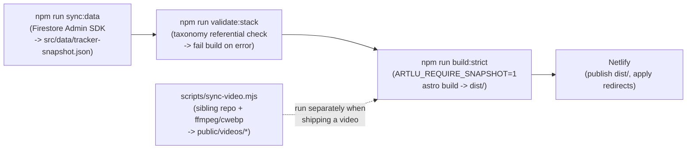

# TECH_STACK.md — the "how"

The concrete technology inventory for this repository: what's actually installed, what's wired into the live build, and (importantly) what's leftover dead code from a previous incarnation. This is the implementation-specific companion to `CLEANROOM_SPEC.md` — where that document deliberately abstracted the stack away, this one names everything.

> **TL;DR:** The live site is **Astro 6, statically generated**, sourced from **Firebase Firestore** (exported to a JSON snapshot at build time), authored through a **vanilla-TypeScript admin** gated by **Firebase Auth (Google)**, with a separate **Node + ffmpeg + cwebp** media pipeline, deployed as static files on **Netlify**. A large set of **React + react-router-dom** files survive in the repo but are **not part of the build** — they are the previous React/Vite SPA.

---

## 1. Stack at a glance

| Layer | Technology | Role |
|---|---|---|
| Site framework | **Astro 6** (`output: "static"`) | File-based routing + static site generation. The build entry point. |
| Build sitemap | `@astrojs/sitemap` | Generates `sitemap`, excluding `/admin`. |
| Language | **TypeScript** + JavaScript (ESM, `"type": "module"`) | Data layer + admin in TS; scripts in `.mjs`. |
| Operational database | **Google Firebase Firestore** | Mutable source of truth: `projects`, `journal`, `mainProjects`, `series`, `technologies`, `siteMeta`. |
| Build-time DB access | **Firebase Admin SDK** (service account) | Privileged read for the snapshot export; also a build-time read fallback. |
| Client DB access | **Firebase JS SDK** (incl. `firestore/lite`) | Admin console writes; build-time public-read fallback. |
| Auth | **Firebase Auth** + Google provider | Admin sign-in, locked to one allow-listed email. |
| Analytics | **Firebase Analytics** | Loaded in the legacy client config. |
| Long-form content | **Astro Content Collections** + **Zod** schema | File-based `research/*.md` channel (not in Firestore). |
| Markdown (build) | `react-markdown`, `remark-gfm`, `remark-breaks` *(legacy)* + a hand-rolled "markdown-lite" renderer *(live)* | Two renderers coexist; the live Astro pages use the hand-rolled one. |
| Feeds | `rss` package; custom endpoints | `rss.xml`, `llms.txt`, `robots.txt`. |
| Media pipeline | **Node.js** scripts + **ffmpeg** (frame extraction) + **cwebp** (`webp` downscale) | Converts a sibling content repo into public video bundles. |
| Hosting / deploy | **Netlify** (static `dist/`, redirects, auto-deploy on git push) | CDN delivery; build command runs the full pipeline. |
| Fonts | Google Fonts (IBM Plex Mono, Inter) via CDN | Dual-theme typography. |
| Interactivity | **Vanilla JS/TS** in inline `<script>` + one TS module | Theme toggle, filter bars, the pan/zoom stack graph, admin. No client-side framework runtime. |
| Runtime | **Node 24** (dev); pipeline docs target Node 22 | — |

---

## 2. The build & runtime model

The site is **fully static**. Visitors are served pre-rendered HTML/JSON from Netlify's CDN — there is no server and no runtime database call on the read path.

The Netlify build command chains the whole pipeline:

```
sync:data  →  validate:stack  →  build:strict
```



- **`sync:data`** runs the Admin SDK against Firestore, filters to public records, and writes `src/data/tracker-snapshot.json`. That file is **git-ignored** — it's a build artifact, regenerated each build.
- **`validate:stack`** loads the snapshot and asserts every public project's stack labels/refs resolve to a known technology (build fails otherwise).
- **`build:strict`** sets `ARTLU_REQUIRE_SNAPSHOT=1` so Astro errors out if the snapshot is missing, rather than silently hitting live Firestore.
- The **video pipeline (`sync-video.mjs`) is run on demand** (when shipping a video), not on every Netlify build — its output (`public/videos/`) is committed.

### npm scripts reference

| Script | What it does |
|---|---|
| `dev` | `astro dev` — local dev server. |
| `build` / `build:strict` | `astro build` (strict forces snapshot presence). |
| `preview` | Serve the built `dist/`. |
| `sync:data` | Export Firestore → `tracker-snapshot.json`. |
| `validate:stack` | Referential integrity check on stack metadata. |
| `seed:main-projects` / `seed:series` / `seed:technologies` | One-off Firestore seeders. |
| `audit:stack` / `migrate:stack-refs` | Stack taxonomy audit + migration helpers. |

---

## 3. Data layer (Firestore)

**Project:** a single Firebase project (`artluai-tracker`). Firestore collections:

| Collection | Holds |
|---|---|
| `projects` | Work items (projects + videos). |
| `journal` | Dated log entries. |
| `mainProjects` | Product-line groupings + branding. |
| `series` | Sub-groupings within a line. |
| `technologies` | Canonical tech taxonomy (id, category, aliases). |
| `siteMeta/publishState` (+ `changes` subcollection) | The "dirty" flag, pending-change counter, and an append-only change journal written on every admin edit. |

**Three ways the data is read** (the build layer tries them in order):
1. The baked **snapshot JSON** (preferred; produced by `sync:data`).
2. **Live Firestore via Admin SDK** (service account credentials).
3. **Live Firestore via the client SDK** (`firestore/lite`).
4. A **local backup JSON** at a fixed path, then bundled **default seed JSON** (`*-defaults.json`) as last resorts.

**Credentials:** the service account is resolved from (in order) an inline JSON env var, a base64 env var, `GOOGLE_APPLICATION_CREDENTIALS`, or a conventional local key path. The client-side Firebase web config (apiKey, authDomain, etc.) is embedded in the front-end as usual for Firebase web apps.

---

## 4. Authoring & auth

- **Admin surface:** `/admin` (and `/admin/settings`) — Astro pages whose interactivity is a single imported **vanilla TypeScript module** (`src/scripts/admin.ts`). No React. It does its own DOM rendering, Firestore reads/writes, and the stack-tag picker.
- **Auth:** Firebase Auth with the Google provider (popup sign-in). Authorization is an **email allow-list of exactly one operator**; an authenticated-but-unauthorized user is immediately signed out.
- **Write side-effects:** every create/update also writes to `siteMeta/publishState` (sets `dirty: true`, increments a counter, records last-changed-by) and appends a record to the `changes` subcollection. This is the change journal — currently informational; publishing is still triggered manually (push to git → Netlify rebuild).
- **Automated authoring:** an MCP server (referenced in `CLAUDE.md`) lets AI agents write the same Firestore collections through a tool bridge.

---

## 5. Routing & pages (Astro)

File-based routing under `src/pages/`. Dynamic routes use `getStaticPaths` to pre-render one page per record at build time.

| Route | Source | Notes |
|---|---|---|
| `/` | snapshot | Home = interactive **stack/relationship graph** (desktop) + mobile stack view. |
| `/list`, `/map` | snapshot | Alternate views of the same entries. |
| `/project/[slug]` | snapshot (`getStaticPaths`) | Per-work-item detail; emits JSON-LD `CreativeWork`. |
| `/video/[id]` | `public/videos/<id>/bundle.json` | Long vs short component by `format`; JSON-LD `VideoObject`. |
| `/log`, `/log/[slug]` | snapshot | Journal list + permalinks; client-side author filter. |
| `/research`, `/research/[slug]` | **Content Collection** (`src/content/research/*.md`) | Zod-validated front-matter. |
| `/rss.xml`, `/llms.txt`, `/robots.txt` | snapshot + collections | Custom endpoint files (`*.ts`). |
| `/admin`, `/admin/settings` | live Firestore | Client-rendered, `noindex`, excluded from sitemap. |

**Redirects (Netlify):** `/journal → /log`, `/journal/* → /log/*`, `/dashboard → /admin` (301s).

---

## 6. Front-end interactivity

There is **no client-side UI framework in the running site.** Interactivity is plain JavaScript/TypeScript:

- **Theme toggle** (light/dark) persisted to `localStorage`, applied via a `data-theme` attribute and CSS variables.
- **Filter bars** (log author filter, etc.) — inline `<script>` reading URL params and toggling DOM visibility.
- **The stack graph** on the home page — a hand-written pan/zoom/`SVG`-wire canvas: nodes for tech, work, projects, and showcases, with focus/lineage highlighting. ~900 lines of vanilla JS in the page's `<script>` block (data injected via Astro's `define:vars`).
- **Admin console** — the single TS module described above.

Styling is inline `<style>`/`<style is:global>` in Astro components driven by a closed set of CSS variables (two themes). No CSS framework.

---

## 7. Media pipeline (`scripts/sync-video.mjs`)

A standalone Node ETL, separate from the Astro build:

- **Input:** a sibling checkout `../spoolcast-content/` (sessions, shows, styles) plus a manifest (`scripts/shipped-videos.json`).
- **Long videos:** read session/shot-list/manifest/audit JSON; copy + downscale scene images.
- **Short videos:** **regex-parse human-edited `script.md`** to recover beats, narration, sources, cost, voice, model; **extract first frames** from clip `.mp4`s.
- **External tools:** **`ffmpeg`** (decode a frame to PNG) → **`cwebp`** (downscale to `webp`, ~640px). ffmpeg's default build lacks libwebp, hence the two-step. Missing tools degrade gracefully (warn + skip).
- **Output:** `public/videos/<id>/bundle.json` (a deliberately path-free, URL-only contract) + `public/videos/index.json`. These are committed to the repo.

---

## 8. ⚠️ Live vs. dead code (important)

The repo contains **two generations of the app**. Only the Astro one is built:

| Status | Files | Why |
|---|---|---|
| **LIVE (Astro)** | `src/pages/**`, `src/layouts/**`, `src/components/*.astro`, `src/scripts/admin.ts`, `src/lib/data.ts`, `src/lib/format.ts`, `src/content.config.ts`, `astro.config.mjs`, `scripts/*.mjs` | The current static site + pipeline. |
| **DEAD (old React+Vite SPA)** | root `index.html`, `src/main.jsx`, `src/App.jsx`, the `src/components/*.jsx` (`Header.jsx`, `ProjectTable.jsx`, `ProjectPage.jsx`, `VideoPage.jsx`, `JournalView.jsx`, `ProjectDetail.jsx`, `Dashboard.jsx`, etc.), `src/lib/db.js`, `src/lib/auth.jsx`, `src/lib/theme.jsx`, `src/lib/firebase.js`, `vite.config.js` | The previous SPA. **Not wired into the Astro build.** |

**How I know they're dead:**
- `astro.config.mjs` declares **no React integration** (`@astrojs/react` is not installed — confirmed absent from `package.json` and `package-lock.json`). Without it, Astro physically cannot render or hydrate `.jsx` components.
- There are **zero `client:*` directives** anywhere in `src/` (the one `client:` match is a string literal in `admin.ts`).
- The `.jsx` components import `react-router-dom` — a *client-side SPA router*, incompatible with Astro's file-based static routing. Their entry is the root `index.html` → `src/main.jsx` (`ReactDOM.createRoot` + `BrowserRouter`), which is the **Vite** entry, not Astro's.
- `react`, `react-dom`, `react-router-dom`, `react-markdown`, and `vite.config.js` therefore linger as **unused dependencies** of the prior build.

> **Rebuild note:** these legacy files can be deleted wholesale without affecting the live site. They mostly duplicate logic that now lives in the Astro layer (e.g. `db.js` vs `data.ts`, multiple `slugify` implementations). The duplication is flagged as debt in `CLEANROOM_SPEC.md` §3.1.

---

## 9. Configuration & environment

| Concern | Mechanism |
|---|---|
| Firebase web config | Embedded in the client config module. |
| Service account (build export) | Env vars (`FIREBASE_SERVICE_ACCOUNT_JSON` / `_B64`, `GOOGLE_APPLICATION_CREDENTIALS`) or a conventional local key path. |
| Data source override | `ARTLU_DATA_SOURCE=firestore` (skip snapshot), `ARTLU_REQUIRE_SNAPSHOT=1` (fail if snapshot missing), `NETLIFY=true` (implies require-snapshot). |
| Admin authorization | Single email constant checked after Google sign-in. |
| Git-ignored | `node_modules`, `dist`, `.astro`, `.env*`, and `src/data/tracker-snapshot.json` (build artifact). |
| Campaign anchor | A fixed start date constant drives all "day N / 100" math. |

---

*Companion to `CLEANROOM_SPEC.md`. That document is the technology-agnostic "what & why"; this one is the concrete "how" as the code stands today.*
