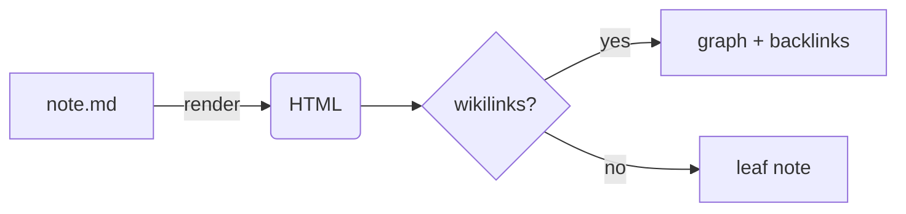

This note exists to prove the renderer is complete, not a subset. If something renders here,
it renders anywhere in the [[Welcome to the Garden|garden]]. ^tour-intro

%% This is a comment and must not appear in the output. %%

## Text

**Bold**, *italic*, ~~strikethrough~~, `inline code`, and ==highlighted text==. A footnote
sits here[^why], and autolinks work: https://artlu.ai.

%%
A block comment.
Also hidden from the rendered page.
%%

## Callouts

> [!note] These are real Obsidian callouts
> Each type has its own color and icon, driven by the site's theme variables.

> [!warning] Heads up
> Callouts can contain **formatting**, `code`, and even [[Wikilinks and Backlinks|links]].

> [!tip]
> A callout with no title falls back to the type name.

> [!example]- Collapsible (click me)
> This one starts collapsed because of the trailing `-`. Click the title to expand it.

> [!danger] Danger
> Red, for the scary stuff.

## Code with highlighting

```js
// Shiki highlights this, themed for light + dark.
export function greet(name) {
  return `hello, ${name}`;
}
```

```python
def fib(n: int) -> int:
    a, b = 0, 1
    for _ in range(n):
        a, b = b, a + b
    return a
```

## Math (KaTeX)

Inline math like $E = mc^2$ flows in a sentence, and display math stands alone:

$$
\int_0^1 x^2 \, dx = \frac{1}{3}
$$

## Diagrams (Mermaid)



## Tables, tasks, lists

| Feature | Status |
|---|---|
| Wikilinks | done |
| Transclusion | done |
| Math | done |

- [x] Parse `[[links]]`
- [x] Build backlinks
- [ ] Plant more notes

## Embeds & transclusion

An image embed (`![[favicon.svg]]`):

![[favicon.svg]]

A full note transcluded inline (`![[On Static Sites]]`):

![[On Static Sites]]

A single transcluded section (`![[Wikilinks and Backlinks#A Linkable Heading]]`):

![[Wikilinks and Backlinks#A Linkable Heading]]

## Tags

Inline tags become filter chips: #demo #reference #obsidian/markdown

[^why]: Footnotes are part of GFM, which the garden pipeline enables.
